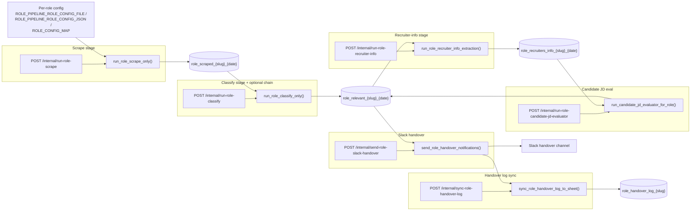
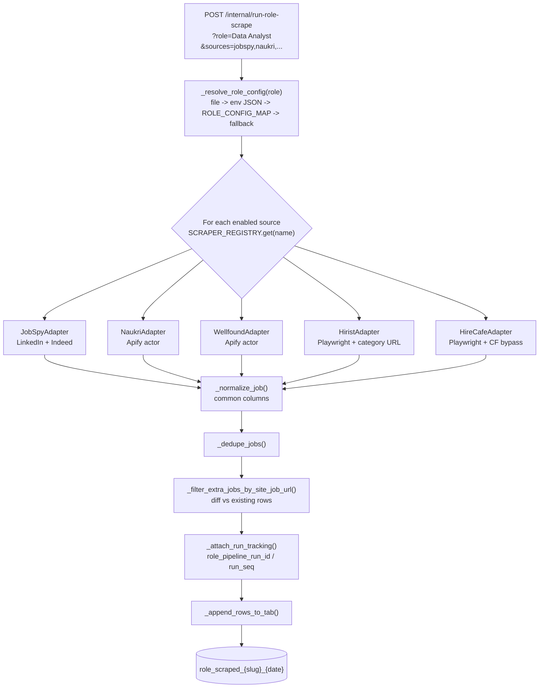
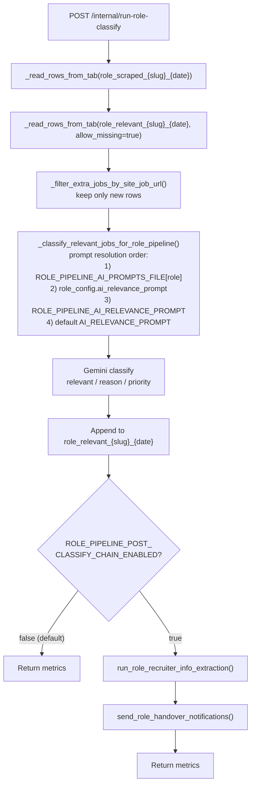
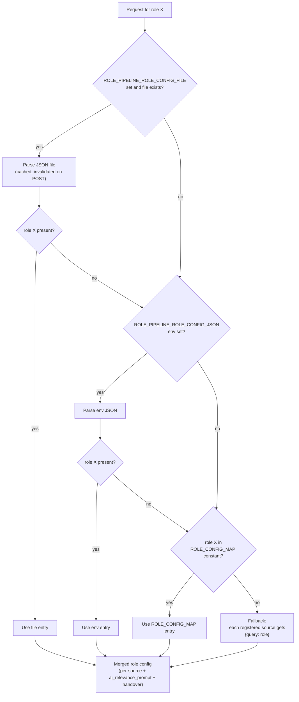
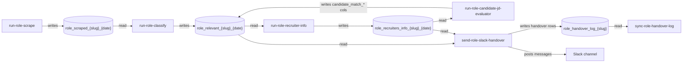

# Jobs Scraper Service

FastAPI service that scrapes jobs and LinkedIn hiring posts from multiple sources,
classifies them with Gemini, writes results to Google Sheets, pulls recruiter
profiles from LinkedIn, scores candidates against JDs, and fires Slack handovers.

The codebase ships **two parallel pipelines**:

- **Legacy daily pipeline** — single shared tab set per day, orchestrated by
  [`services/pipeline.py`](services/pipeline.py) (`run_daily_jobs_pipeline`).
- **Role-based pipeline** (the main focus of this README) — one isolated
  scrape/classify/recruiter/candidate/slack/log chain **per role**, orchestrated
  by [`services/role_pipeline.py`](services/role_pipeline.py) and the sibling
  LinkedIn-posts track in
  [`services/role_linkedin_posts_pipeline.py`](services/role_linkedin_posts_pipeline.py).

---

## Table of contents

1. [Quick start](#quick-start)
2. [Role-Based Pipeline](#role-based-pipeline)
   - [End-to-end flow](#end-to-end-flow)
   - [Scrape stage internals](#scrape-stage-internals)
   - [Classify stage with post-classify chain](#classify-stage-with-post-classify-chain)
   - [Per-role config resolution](#per-role-config-resolution)
   - [Cron timeline](#cron-timeline)
   - [Sheet tab data flow](#sheet-tab-data-flow)
   - [Endpoints](#role-pipeline-endpoints)
   - [Tab naming](#tab-naming)
   - [Per-role config file](#per-role-config-file)
   - [Cron controls](#cron-controls)
3. [Role LinkedIn Posts Pipeline](#role-linkedin-posts-pipeline)
4. [Legacy Daily Pipeline](#legacy-daily-pipeline)
5. [Jobs Query API](#jobs-query-api)
6. [Operational notes](#operational-notes)
7. [Environment variables reference](#environment-variables-reference)

---

## Quick start

### Python version

Use **Python 3.11**. `python-jobspy` pins `numpy==1.26.3`, and Python 3.14 forces
a source build of NumPy which fails on macOS.

### Local setup

```bash
python3.11 -m venv .venv
source .venv/bin/activate
python -m pip install --upgrade pip
pip install -r requirements.txt
```

If you already created a `3.14` venv, delete and recreate it:

```bash
deactivate 2>/dev/null || true
rm -rf .venv
python3.11 -m venv .venv
source .venv/bin/activate
python -m pip install --upgrade pip
pip install -r requirements.txt
```

### Run API locally

```bash
uvicorn main:app --reload
```

- Base URL: `http://127.0.0.1:8000`
- Interactive docs: `http://127.0.0.1:8000/docs`
- Simple search frontend: `http://127.0.0.1:8000/`
- Health: `http://127.0.0.1:8000/health`

### Deploy to Railway

The repo ships a production [`Dockerfile`](Dockerfile) (Python 3.11 slim +
Chromium + Playwright) and [`railway.toml`](railway.toml) with
`healthcheckPath = /health`.

1. Push to GitHub.
2. Railway -> **New Project** -> **Deploy from GitHub repo** (auto-detects Dockerfile).
3. Set required env vars in the Railway dashboard (see
   [Environment variables reference](#environment-variables-reference)). At a
   minimum: `INTERNAL_TRIGGER_TOKEN`, `GOOGLE_SPREADSHEET_ID`,
   `GOOGLE_SHEETS_CREDENTIALS_JSON`, `GEMINI_API_KEY`, `APIFY_TOKEN`,
   `CRON_TIMEZONE`.
4. Mount a Railway volume at `/data` so LinkedIn sessions and uploaded
   role-config JSON survive redeploys.
5. Add a Railway MySQL service and set the standard Railway MySQL env vars.
   Run `migrations/001_recruiter_crm_mysql.sql` once on that database.
   If you already created tables before the LinkedIn URL dedupe fix, also run
   `migrations/002_enforce_unique_linkedin_url.sql`.

All write endpoints under `/internal/*` require the
`x-internal-token: $INTERNAL_TRIGGER_TOKEN` header.

---

## Role-Based Pipeline

A role is just a human-readable string (e.g. `Data Analyst`, `Software Developer`,
`DevOps`). For each role, the pipeline produces its own set of Google Sheet
tabs keyed by a URL-safe slug and the run date:

| Stage           | Tab template                                      |
|-----------------|---------------------------------------------------|
| Scrape          | `role_scraped_{role_slug}_{date}`                 |
| Classify        | `role_relevant_{role_slug}_{date}`                |
| Recruiter info  | `role_recruiters_info_{role_slug}_{date}`         |
| Candidate match | `candidate_match_{role_slug}_{date}` (appended)   |
| Handover log    | `role_handover_log_{role_slug}`                   |

Each stage is idempotent — it only appends **new** rows based on
`(site, job_url)` identity, and tags them with a `role_pipeline_run_id` and a
per-tab monotonically increasing `role_pipeline_run_seq`.

### End-to-end flow



### Scrape stage internals

The scrape stage is built around a pluggable adapter protocol
(`RoleJobScraper` in [`services/role_scrapers.py`](services/role_scrapers.py)).
Each adapter reads only the keys it cares about from its own config dict and
falls back to env defaults, so adding a new source is just "register another
adapter".



Supported sources out of the box:

- `jobspy` — LinkedIn + Indeed via [`python-jobspy`](https://pypi.org/project/python-jobspy/).
- `naukri` — Apify actor (requires `APIFY_TOKEN`).
- `wellfound` — Apify actor (requires `APIFY_TOKEN`; toggle with `APIFY_WELLFOUND_ENABLED`).
- `hirist` — Playwright scrape of a category URL
  (e.g. `https://www.hirist.tech/c/data-analytics-bi-jobs?ref=topnavigation`).
- `hirecafe` — Playwright + Cloudflare bypass for `hiring.cafe`.

You choose which sources run per request via the `sources` query param
(comma-separated); omit it to run all registered sources.

### Classify stage with post-classify chain

Classify reads the scraped tab, diffs against what is already in the relevant
tab (so reruns are safe), picks the right Gemini prompt, and optionally chains
recruiter-info extraction + Slack handover when
`ROLE_PIPELINE_POST_CLASSIFY_CHAIN_ENABLED=true`.



### Per-role config resolution

The config lookup in `_resolve_role_config` / `_load_role_config_map` of
[`services/role_pipeline.py`](services/role_pipeline.py):



### Cron timeline

When `ENABLE_ROLE_PIPELINE_CRON=true`, stages run at fixed slots within
`CRON_TIMEZONE` (the chart below shows one 3-hour cycle; it repeats at +3h,
+6h, +9h, i.e. starting 07:30, 10:30, 13:30, 16:30):

```mermaid
gantt
    title Role pipeline intraday cron (one 3-hour cycle, CRON_TIMEZONE)
    dateFormat HH:mm
    axisFormat %H:%M

    section Jobs track
    Scrape           :s1, 07:30, 5m
    Classify         :c1, 08:00, 5m
    Recruiter info   :r1, 08:15, 5m
    Candidate JD eval:j1, 08:30, 5m
    Slack handover   :h1, 09:30, 5m
    Handover log sync:l1, 09:35, 5m

    section LinkedIn posts track
    Posts scrape     :ps1, 07:50, 5m
    Posts classify   :pc1, 08:20, 5m
```



### Sheet tab data flow

Useful for debugging: if a row is missing in Slack, walk this graph backwards
from the Slack node to find where it dropped out.



### Role pipeline endpoints

All endpoints require `x-internal-token: $INTERNAL_TRIGGER_TOKEN`.
`role` is **required** where shown. `run_date` defaults to today in
`CRON_TIMEZONE`. `sources` defaults to all registered sources.

| Method | Path                                                 | Purpose                                              |
|--------|------------------------------------------------------|------------------------------------------------------|
| POST   | `/internal/run-role-scrape`                          | Scrape jobs for a role (async; returns `run_id`).    |
| GET    | `/internal/run-role-scrape/{run_id}`                 | Scrape run metrics.                                  |
| POST   | `/internal/run-role-classify`                        | Classify + optional post-classify chain.             |
| GET    | `/internal/run-role-classify/{run_id}`               | Classify run metrics.                                |
| POST   | `/internal/run-role-recruiter-info`                  | LinkedIn recruiter profile scrape.                   |
| GET    | `/internal/run-role-recruiter-info/{run_id}`         | Recruiter run metrics.                               |
| POST   | `/internal/run-role-candidate-jd-evaluator`          | Score candidates vs JDs (writes `candidate_match_*`). |
| POST   | `/internal/send-role-slack-handover`                 | Slack recruiter/internal-POC + LinkedIn-post leads.  |
| POST   | `/internal/send-role-relevant-jobs-handover`         | Bulk Slack from `role_relevant_*` (legacy).          |
| POST   | `/internal/sync-role-handover-log`                   | Append handover rows to `HANDOVER_LOG_SPREADSHEET_ID`. |
| POST   | `/internal/role-pipeline-role-config`                | Upload role config JSON to volume file.              |
| GET    | `/internal/volume-role-config-status`                | Check volume-backed config file presence + size.     |
| POST   | `/internal/trigger-role-pipeline-cron-scrape`        | Manually trigger the scrape cron job.                |
| POST   | `/internal/trigger-role-pipeline-cron-classify`      | Manually trigger the classify cron job.              |
| POST   | `/internal/trigger-role-pipeline-cron-recruiter-info`| Manually trigger recruiter-info cron job.            |
| POST   | `/internal/trigger-role-pipeline-cron-candidate-jd-eval` | Manually trigger candidate-JD-eval cron job.     |
| POST   | `/internal/trigger-role-pipeline-cron-slack-handover`| Manually trigger slack-handover cron job.            |
| POST   | `/internal/trigger-role-pipeline-cron-handover-log-sync` | Manually trigger handover-log-sync cron job.     |

Example: full chain for a single role on today's date.

```bash
TOKEN=$INTERNAL_TRIGGER_TOKEN
HOST=http://127.0.0.1:8000
ROLE="Data Analyst"

curl -s -X POST "$HOST/internal/run-role-scrape?role=$(printf %s "$ROLE" | jq -sRr @uri)&sources=jobspy,naukri,wellfound,hirist" \
  -H "x-internal-token: $TOKEN"

curl -s -X POST "$HOST/internal/run-role-classify?role=$(printf %s "$ROLE" | jq -sRr @uri)" \
  -H "x-internal-token: $TOKEN"

curl -s -X POST "$HOST/internal/run-role-recruiter-info?role=$(printf %s "$ROLE" | jq -sRr @uri)" \
  -H "x-internal-token: $TOKEN"

curl -s -X POST "$HOST/internal/run-role-candidate-jd-evaluator" \
  -H "x-internal-token: $TOKEN" \
  -H "content-type: application/json" \
  -d "{\"role\":\"$ROLE\"}"

curl -s -X POST "$HOST/internal/send-role-slack-handover" \
  -H "x-internal-token: $TOKEN" \
  -H "content-type: application/json" \
  -d "{\"role\":\"$ROLE\"}"

curl -s -X POST "$HOST/internal/sync-role-handover-log?role=$(printf %s "$ROLE" | jq -sRr @uri)" \
  -H "x-internal-token: $TOKEN"
```

### Tab naming

Default templates (overridable via env):

| Tab             | Default template                                | Override env var                          |
|-----------------|-------------------------------------------------|-------------------------------------------|
| Scraped         | `role_scraped_{role_slug}_{date}`               | `ROLE_PIPELINE_SCRAPED_TAB_TEMPLATE`      |
| Relevant        | `role_relevant_{role_slug}_{date}`              | `ROLE_PIPELINE_RELEVANT_TAB_TEMPLATE`     |
| Recruiters info | `role_recruiters_info_{role_slug}_{date}`       | `ROLE_PIPELINE_RECRUITERS_TAB_TEMPLATE`   |

`role_slug` is generated by lowercasing the role and replacing every
non-alphanumeric run with `_` (e.g. `"Data Analyst"` -> `data_analyst`).

The role pipeline writes to `ROLE_PIPELINE_GOOGLE_SPREADSHEET_ID` if set,
otherwise falls back to `GOOGLE_SPREADSHEET_ID`.

### Per-role config file

The big knob. A single JSON object maps each role (lowercased) to its per-source
settings plus two reserved keys:

```json
{
  "data analyst": {
    "jobspy":    { "query": "Data Analyst", "linkedin_results": 50, "indeed_results": 50 },
    "naukri":    { "query": "Data Analyst", "max_jobs": 50, "freshness": "1" },
    "wellfound": { "query": "Data Analyst", "location": "india", "results_wanted": 50 },
    "hirist":    { "url": "https://www.hirist.tech/c/data-analytics-bi-jobs?ref=topnavigation" },
    "handover":  { "min_candidate_match": 0 },
    "ai_relevance_prompt": "You are a job listing classifier ..."
  }
}
```

Reserved keys:

- `ai_relevance_prompt` — per-role Gemini prompt override. Wins over the global
  `ROLE_PIPELINE_AI_RELEVANCE_PROMPT` env var.
- `handover.min_candidate_match` — minimum count of candidates scoring >70 in
  `candidate_match_*` for the job to be posted. `0` means "post everything".

Full working examples:

- Jobs: [`examples/role_pipeline_role_config.example.json`](examples/role_pipeline_role_config.example.json)
- LinkedIn posts: [`examples/role_linkedin_posts_role_config.example.json`](examples/role_linkedin_posts_role_config.example.json)

Upload the config to a Railway volume:

```bash
curl -s -X POST "$HOST/internal/role-pipeline-role-config" \
  -H "x-internal-token: $TOKEN" \
  -H "content-type: application/json" \
  --data-binary @examples/role_pipeline_role_config.example.json
```

This requires `ROLE_PIPELINE_ROLE_CONFIG_FILE` to be set (e.g.
`/data/role_pipeline_role_config.json`) and the process cache is invalidated
automatically after the upload. Check status with
`GET /internal/volume-role-config-status`.

If you prefer to keep the prompts in a separate file, set
`ROLE_PIPELINE_AI_PROMPTS_FILE=/data/role_pipeline_ai_prompts.json` — a flat
`{ "role label": "prompt string" }` map, checked **before** the config's
`ai_relevance_prompt`.

### Cron controls

Three master switches gate which cron tracks start at boot:

| Env var                                  | Default | Effect                                           |
|------------------------------------------|---------|--------------------------------------------------|
| `ENABLE_INTERNAL_CRON`                   | `false` | Global kill switch for **all** cron jobs.        |
| `ENABLE_LEGACY_CRON_JOBS`                | `true`  | Legacy daily pipeline + shared recruiter cron.   |
| `ENABLE_ROLE_PIPELINE_CRON`              | `false` | Role-based jobs pipeline cron.                   |
| `ENABLE_ROLE_LINKEDIN_POSTS_PIPELINE_CRON` | `false` | Role LinkedIn posts pipeline cron.             |

Which roles the cron runs on:

- `ROLE_PIPELINE_CRON_ROLES` — comma-separated list, preferred.
- `ROLE_PIPELINE_CRON_ROLE` — single role, backward-compat fallback
  (defaults to `Data Analyst`).

Each stage runs one subprocess per role per slot.

To run **only the role-based cron** (for example for a week):

```bash
ENABLE_INTERNAL_CRON=true
ENABLE_LEGACY_CRON_JOBS=false
ENABLE_ROLE_PIPELINE_CRON=true
ROLE_PIPELINE_CRON_ROLES="Data Analyst,Software Developer"
CRON_TIMEZONE=Asia/Kolkata
```

---

## Role LinkedIn Posts Pipeline

Driven by [`services/role_linkedin_posts_pipeline.py`](services/role_linkedin_posts_pipeline.py).
Scrapes LinkedIn hiring posts via the Apify LinkedIn-posts actor, classifies
them with a per-role Gemini prompt, and posts Slack notifications with the same
owner round-robin as the jobs track.

- Config file env vars: `ROLE_LINKEDIN_POSTS_ROLE_CONFIG_FILE` /
  `ROLE_LINKEDIN_POSTS_ROLE_CONFIG_JSON` /
  `ROLE_LINKEDIN_POSTS_AI_PROMPTS_FILE`.
- Example: [`examples/role_linkedin_posts_role_config.example.json`](examples/role_linkedin_posts_role_config.example.json).
- Upload endpoint: `POST /internal/role-linkedin-posts-role-config`.

Endpoints:

| Method | Path                                                  | Purpose                   |
|--------|-------------------------------------------------------|---------------------------|
| POST   | `/internal/run-role-linkedin-posts-scrape`            | Scrape posts for a role.  |
| GET    | `/internal/run-role-linkedin-posts-scrape/{run_id}`   | Scrape run metrics.       |
| POST   | `/internal/run-role-linkedin-posts-classify`          | Classify scraped posts.   |
| GET    | `/internal/run-role-linkedin-posts-classify/{run_id}` | Classify run metrics.     |
| POST   | `/internal/run-role-linkedin-posts-notify`            | Slack notify run.         |
| GET    | `/internal/run-role-linkedin-posts-notify/{run_id}`   | Notify run metrics.       |
| POST   | `/internal/trigger-role-linkedin-posts-cron-scrape`   | Trigger scrape cron.      |
| POST   | `/internal/trigger-role-linkedin-posts-cron-classify` | Trigger classify cron.    |

---

## Legacy Daily Pipeline

`run_daily_jobs_pipeline` in [`services/pipeline.py`](services/pipeline.py)
writes into shared (non role-slug) tabs:

- `scraped_jobs_{date}`
- `relevant_jobs_{date}`
- `recruiters_info_{date}`
- `linkedin_posts_relevant_{date}`

Endpoints:

| Method | Path                                              | Purpose                               |
|--------|---------------------------------------------------|---------------------------------------|
| POST   | `/internal/run-daily-jobs`                        | Full legacy daily pipeline.           |
| POST   | `/internal/run-scrape-jobs`                       | Legacy scrape-only.                   |
| POST   | `/internal/run-classify-relevant`                 | Legacy classify-only.                 |
| POST   | `/internal/run-recruiter-info`                    | Legacy recruiter info extraction.     |
| POST   | `/internal/run-recruiter-profile-backfill`        | Backfill recruiter profile URLs from Lusha into recruiter-info tabs. |
| POST   | `/internal/run-candidate-jd-evaluator`            | Legacy candidate-JD evaluator.        |
| POST   | `/internal/run-candidate-match-slack`             | Legacy candidate match Slack post.    |
| POST   | `/internal/fix-relevant-jobs-tab`                 | Repair tool for `relevant_jobs_*`.    |
| POST   | `/internal/run-naukri-scrape`                     | Naukri-only pipeline.                 |
| POST   | `/internal/run-wellfound-scrape`                  | Wellfound-only scrape.                |
| POST   | `/internal/run-wellfound-classify`                | Wellfound-only classify.              |
| POST   | `/internal/run-hirecafe-scrape`                   | HireCafe-only scrape.                 |
| POST   | `/internal/run-hirist-scrape`                     | Hirist-only scrape.                   |
| POST   | `/internal/run-linkedin-posts`                    | Legacy LinkedIn posts pipeline.       |
| POST   | `/internal/send-slack-handover`                   | Legacy Slack handover.                |
| POST   | `/internal/send-slack-handover-summary`           | Legacy Slack summary message.         |
| POST   | `/internal/sync-handover-log`                     | Legacy handover log sync.             |
| POST   | `/internal/linkedin-auto-login`                   | Playwright LinkedIn auto-login.       |
| POST   | `/internal/linkedin-session`                      | Upload a local `linkedin_storage.json`. |

The legacy cron schedule (when `ENABLE_LEGACY_CRON_JOBS=true`):

- Daily scrape: `00:10 CRON_TIMEZONE`
- Daily classify: `01:00`
- Daily recruiter info: `03:00`
- Daily candidate match + Slack: `04:00`

---

## Jobs Query API

The public, synchronous `/jobs` endpoint wraps
[`python-jobspy`](https://pypi.org/project/python-jobspy/) for ad-hoc searches:

```bash
curl "http://127.0.0.1:8000/jobs?search_term=python%20developer&location=India&results_wanted=15&hours_old=72"
```

Multiple sources:

```bash
curl "http://127.0.0.1:8000/jobs?site_name=linkedin&site_name=indeed&search_term=software%20engineer&location=India&country_indeed=india"
```

Query params:

- `site_name` (repeatable, default `linkedin`) — one of `linkedin`, `indeed`,
  `glassdoor`, `google`, `bayt`, `naukri`.
- `search_term` (default `software engineer`).
- `google_search_term` — required when `site_name=google`.
- `location` (default `India`).
- `country_indeed` (default `india`, for Indeed/Glassdoor).
- `results_wanted` (default `20`, range `1-100`).
- `hours_old` (optional, range `1-720`).
- `linkedin_fetch_description` (default `false`).
- `offset` (default `0`).
- `verbose` (`0-2`).

---

## Operational notes

### HireCafe Cloudflare strategy

Playwright opens `hiring.cafe`, waits for Cloudflare challenge markers, attempts
an iframe checkbox click then a coordinate-based fallback click, waits for
clearance, and only then starts randomized scrolling to let the job APIs load.

Key knobs: `HIRECAFE_CLOUDFLARE_WAIT_SECONDS` (10),
`HIRECAFE_CF_CLEAR_TIMEOUT_SECONDS` (35),
`HIRECAFE_POST_VERIFY_WAIT_SECONDS` (8),
`HIRECAFE_CF_CLICK_X` / `HIRECAFE_CF_CLICK_Y` (544 / 334),
`HIRECAFE_MIN_SCROLL_DELAY_SECONDS` / `HIRECAFE_MAX_SCROLL_DELAY_SECONDS`
(0.7 / 1.8), `HIRECAFE_SCROLL_PIXELS` (1200),
`HIRECAFE_MAX_RUNTIME_SECONDS` (300),
`HIRECAFE_MAX_IDLE_SECONDS` (90), `HIRECAFE_MAX_SCROLLS` (500),
`HIRECAFE_HEARTBEAT_EVERY_SECONDS` (15).

### Long-text columns

Job descriptions and LinkedIn post text are split across 3 sheet columns so
Google Sheets' 50k-chars-per-cell limit doesn't truncate them:

- Jobs: `description`, `description_2`, `description_3`
- LinkedIn posts: `post_text`, `post_text_2`, `post_text_3`

Overflow spills forward; if all 3 are full, only the remainder is truncated and
a notice is appended in the third column. Cap per column:
`SHEETS_TEXT_PART_MAX_CHARS` (default: `GOOGLE_SHEETS_MAX_CELL_CHARS`,
fallback `48000`).

Relevance classification concatenates all 3 parts before capping:

- Jobs: `JOBS_RELEVANCE_TEXT_MAX_CHARS_SINGLE` (12000),
  `JOBS_RELEVANCE_TEXT_MAX_CHARS_BATCH` (9000).
- LinkedIn posts: `LINKEDIN_POSTS_RELEVANCE_TEXT_MAX_CHARS_SINGLE` (9000),
  `LINKEDIN_POSTS_RELEVANCE_TEXT_MAX_CHARS_BATCH` (7000).

### Wellfound actor probe

Use [`wellfound_actor_probe.py`](wellfound_actor_probe.py) to check which
Apify-Wellfound inputs the actor currently accepts and what output keys it
returns:

```bash
APIFY_TOKEN=... python wellfound_actor_probe.py --location india --results-wanted 3 --max-pages 1
```

### LinkedIn sessions

- Manual login locally: [`linkedin_manual_login.py`](linkedin_manual_login.py)
  opens a Chromium window so you can log in; it saves
  `linkedin_storage.json`.
- Upload to the deployed service:
  `POST /internal/linkedin-session` with the file as the body, or set
  `LINKEDIN_SESSION_UPLOAD_URL` + `INTERNAL_TRIGGER_TOKEN` and the script
  auto-uploads.
- On Railway, mount a volume at `/data` and set
  `LINKEDIN_STORAGE_PATH=/data/linkedin_storage.json` so the session survives
  redeploys.

---

## Environment variables reference

Grouped by concern. Only the high-signal ones are listed; see
[`railway.toml`](railway.toml) and [`services/role_scrapers.py`](services/role_scrapers.py)
for the long tail.

**Auth & global**

- `INTERNAL_TRIGGER_TOKEN` — required header for `/internal/*`.
- `CRON_TIMEZONE` — e.g. `Asia/Kolkata`.
- `APP_LOG_LEVEL` — default `INFO`.

**Google Sheets**

- `GOOGLE_SPREADSHEET_ID` — default spreadsheet for all tabs.
- `ROLE_PIPELINE_GOOGLE_SPREADSHEET_ID` — role pipeline override.
- `GOOGLE_SHEETS_CREDENTIALS_JSON` — service-account JSON (raw).
- `GOOGLE_SHEETS_WRITE_CHUNK_SIZE` — default `200`.
- `GOOGLE_SHEETS_MAX_CELL_CHARS` / `SHEETS_TEXT_PART_MAX_CHARS` — per-cell caps.
- `HANDOVER_LOG_SPREADSHEET_ID` — destination spreadsheet for handover log sync.

**Gemini / classification**

- `GEMINI_API_KEY`.
- `AI_RELEVANCE_PROMPT` — global default prompt.
- `ROLE_PIPELINE_AI_RELEVANCE_PROMPT` — role-pipeline-wide override.
- `ROLE_PIPELINE_AI_PROMPTS_FILE` — per-role prompts map path.

**Role pipeline (jobs)**

- `ENABLE_ROLE_PIPELINE_CRON` (default `false`).
- `ROLE_PIPELINE_CRON_ROLES` / `ROLE_PIPELINE_CRON_ROLE`.
- `ROLE_PIPELINE_ROLE_CONFIG_FILE` (volume path, e.g. `/data/role_pipeline_role_config.json`).
- `ROLE_PIPELINE_ROLE_CONFIG_JSON` (inline JSON env alternative).
- `ROLE_PIPELINE_SCRAPED_TAB_TEMPLATE` / `_RELEVANT_TAB_TEMPLATE` / `_RECRUITERS_TAB_TEMPLATE`.
- `ROLE_PIPELINE_POST_CLASSIFY_CHAIN_ENABLED` (default `false`).
- `ROLE_PIPELINE_HIRIST_FIXED_URL` — default Hirist category URL.

**Role pipeline (LinkedIn posts)**

- `ENABLE_ROLE_LINKEDIN_POSTS_PIPELINE_CRON` (default `false`).
- `ROLE_LINKEDIN_POSTS_ROLE_CONFIG_FILE` / `_JSON`.
- `ROLE_LINKEDIN_POSTS_AI_PROMPTS_FILE`.
- `AI_RELEVANCE_PROMPT_LINKEDIN_POSTS`.

**Apify sources**

- `APIFY_TOKEN`.
- `APIFY_MAX_JOBS_NAUKRI`, `APIFY_FRESHNESS`, `APIFY_FETCH_DETAILS`.
- `APIFY_WELLFOUND_ENABLED` (default `true`), `APIFY_WELLFOUND_LOCATION`,
  `APIFY_MAX_JOBS_WELLFOUND_PER_ROLE`, `APIFY_WELLFOUND_MAX_PAGES`,
  `APIFY_WELLFOUND_USE_PROXY`, `APIFY_WELLFOUND_PROXY_GROUPS`.
- `APIFY_LINKEDIN_POSTS_ACTOR_ID`, `APIFY_LINKEDIN_POST_QUERIES`,
  `APIFY_LINKEDIN_POSTS_MAX_POSTS`, `APIFY_LINKEDIN_POSTS_POSTED_LIMIT`,
  `APIFY_LINKEDIN_POSTS_SORT_BY`.

**HireCafe** — see the knobs listed under
[Operational notes](#hirecafe-cloudflare-strategy).

**Hirist**

- `HIRIST_MAX_SCROLLS` (250), `HIRIST_MAX_RUNTIME_SECONDS` (300),
  `HIRIST_MAX_IDLE_SECONDS` (90),
  `HIRIST_MIN_SCROLL_DELAY_SECONDS` / `_MAX_SCROLL_DELAY_SECONDS` (1.0 / 2.0),
  `HIRIST_HEADLESS` (true), `HIRIST_RECENT_MAX_AGE_HOURS` (24),
  `HIRIST_INCLUDE_JOB_DESCRIPTION` (true).

**LinkedIn (sessions + recruiter)**

- `LINKEDIN_EMAIL`, `LINKEDIN_PASSWORD`, `LINKEDIN_HEADLESS`.
- `LINKEDIN_STORAGE_PATH=/data/linkedin_storage.json`.
- `LINKEDIN_SESSION_UPLOAD_URL` — used by `linkedin_manual_login.py`.
- `LINKEDIN_RECRUITER_SHEET_ENABLED` (true/false),
  `LINKEDIN_RECRUITER_MAX_URLS_PER_RUN`,
  `LINKEDIN_RECRUITER_RETRY_COUNT`, `LINKEDIN_RECRUITER_RETRY_BASE_DELAY_S`,
  `LINKEDIN_RECRUITER_BETWEEN_JOBS_MIN_S` / `_MAX_S`,
  `LINKEDIN_RECRUITER_HYDRATION_JITTER`,
  `LINKEDIN_RECRUITER_LAUNCH_RETRY_COUNT` / `_DELAY_S`,
  `LINKEDIN_RECRUITER_RECYCLE_EVERY`,
  `LINKEDIN_RECRUITER_FORCE_FAIL_TIMEOUT_S`.

**Lusha recruiter backfill**

- `LUSHA_API_KEY` — required for recruiter-profile backfill.
- `LUSHA_BASE_URL` — default `https://api.lusha.com`.
- `LUSHA_TIMEOUT_SECONDS` — request timeout for Lusha calls (default `20`).
- `LUSHA_RETRY_COUNT` — retry attempts for failed Lusha calls (default `2`).
- `LUSHA_TOP_CONTACTS_PER_JOB` — max contacts to enrich per job row (default `1`).
- `LUSHA_RECRUITER_TITLES` — optional comma-separated title override for contact search.
- `RECRUITER_PROFILE_BACKFILL_COMPANY_SIZE_ALLOWLIST` — comma-separated `company_size` values from the relevant jobs tab that may be sent to Lusha (default `startup,mid_level`). Set to empty or `*` to disable filtering (legacy tabs without `company_size`).
- `MYSQLHOST`, `MYSQLPORT`, `MYSQLUSER`, `MYSQLPASSWORD`, `MYSQLDATABASE` —
  Railway MySQL connection vars used by the recruiter-store upsert path.

**Slack / handover**

- `SLACK_BOT_TOKEN`, `SLACK_CHANNEL_ID`.
- `OWNER_SHEET_NAME` (default `owner_slack_ID`).
- `INTERNAL_POC_TAG_SHEET_NAME` (default `internal_poc_slack`).
- `COMPANY_CONTACTS_SHEET_NAME`, `COMPANY_CONTACTS_COMPANY_COLUMN`,
  `COMPANY_CONTACTS_EMAIL_COLUMN`.
- `LINKEDIN_POSTS_OWNER_HANDOVER` (default `true`).
